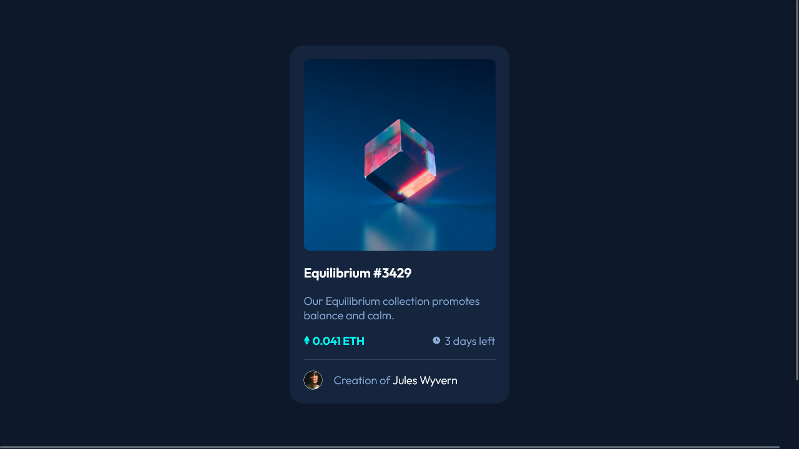

# Frontend Mentor - NFT preview card component solution

This is a solution to the [NFT preview card component challenge on Frontend Mentor](https://www.frontendmentor.io/challenges/nft-preview-card-component-SbdUL_w0U). Frontend Mentor challenges help you improve your coding skills by building realistic projects.

## Table of contents

- [The challenge](#the-challenge)
- [Screenshot](#screenshot)
- [Links](#links)
- [Built with](#built-with)
- [What I learned](#what-i-learned)
- [Useful resources](#useful-resources)
- [Author](#author)

### The challenge

Users should be able to:

- View the optimal layout depending on their device's screen size
- See hover states for interactive elements

### Screenshot



### Links

- Live Site URL: [@GitHub](https://htmlpreview.github.io/?https://github.com/xdelmo/nft-preview-card-component/blob/master/index.html)

### Built with

- Semantic HTML5 markup
- CSS custom properties
- Flexbox
- Mobile-first workflow

### What I learned

The main challenge was to overlay the eye icon with a matt cyan background on the main image of the card.
This is my way to solved the problem:

```css
/* hover img classes */

.card__img {
  position: relative;
  transition: 0.5s ease-in-out;
}

.card__img__hover {
  position: absolute;
  top: 50%;
  left: 50%;
  border-radius: 0.5em;

  /* to  fill the whole img div */
  width: 100%;

  background-color: hsla(178, 100%, 50%, 0.5);
  transition: 0.5s ease-in-out;
  opacity: 0;
  transform: translate(-50%, -50%);
  -ms-transform: translate(-50%, -50%);
}

.card__img:hover .card__img__hover {
  opacity: 1;
}

/* downscale viewicon keeping 100% width on the main img div */
.card__img__hover__icon {
  transform: scale(0.2);
}
```

### Useful resources

- [W3Schools Image Overlay Tutorial](https://www.w3schools.com/howto/howto_css_image_overlay_icon.asp) - This tutorial helped me to overlay the eye icon on the main image

## Author

- Website - [Emanuele Del Monte](https://www.emanueledelmonte.it)
- Frontend Mentor - [@xdelmo](https://www.frontendmentor.io/profile/xdelmo)
